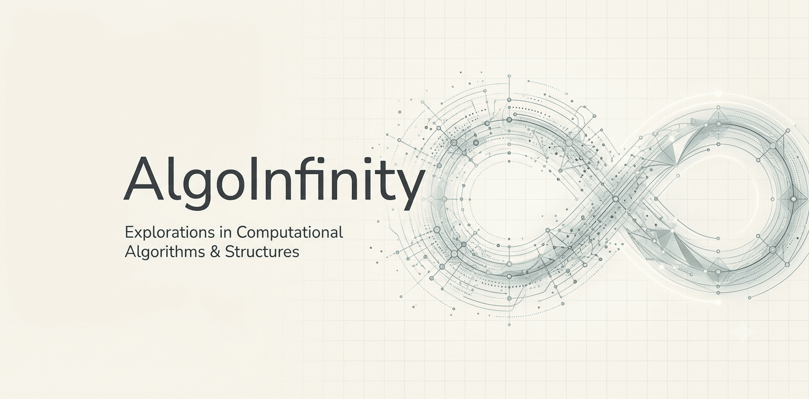
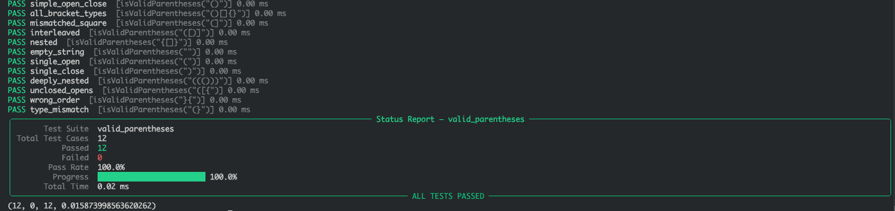

# AlgoInfinity

  

A structured repo mastering DSA. Each problem includes multiple solution tiers (Brute-Force, Slight-Optimal, Optimal, and Sub-Optimal edge-case variants) with deep complexity tradeoffs. Every directory features a notes.md mapping out key intuitions, edge cases handled, and core reusable code patterns learned during the process.

### Running for Test cases : 
Just run the Python file and it should automatically displays proper results with proper Status : 

  

